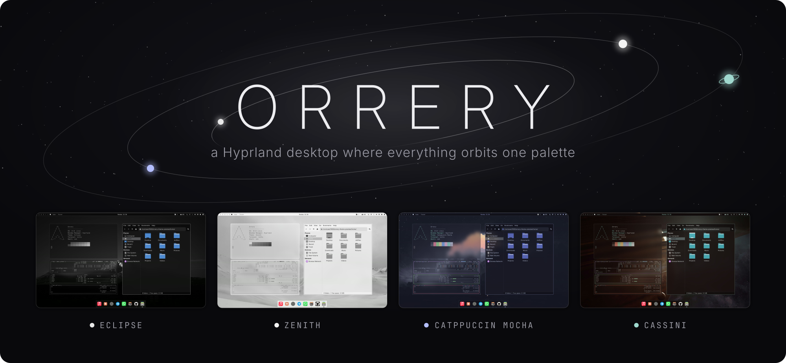
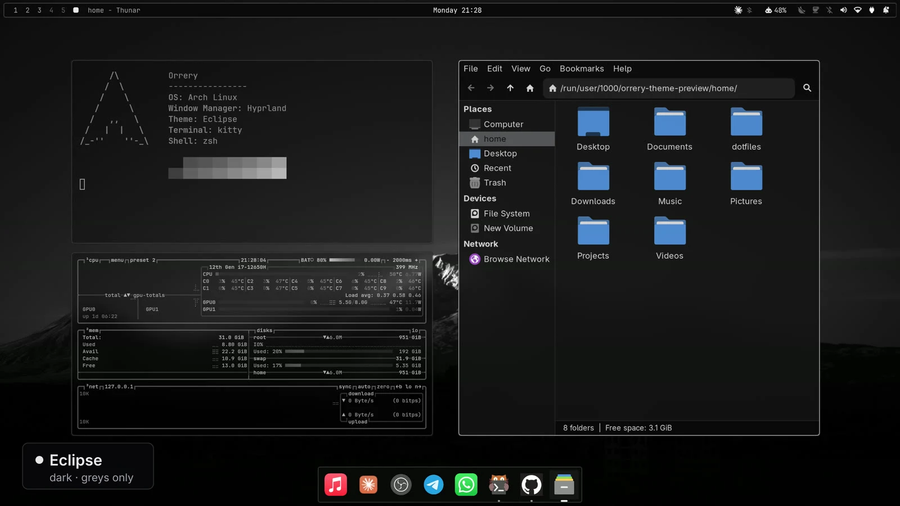
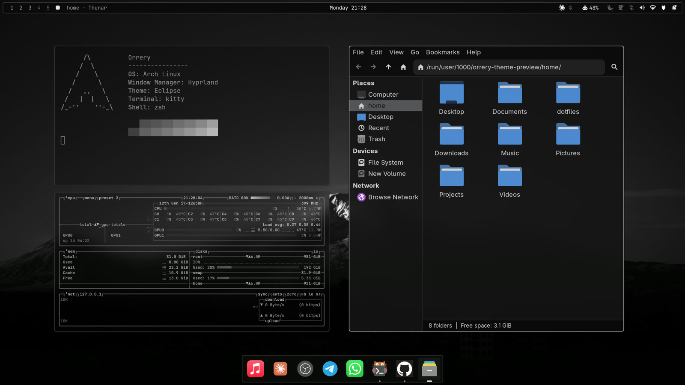
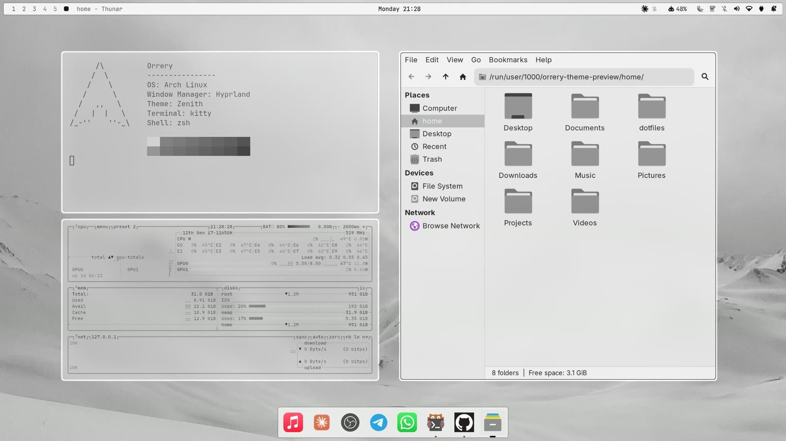
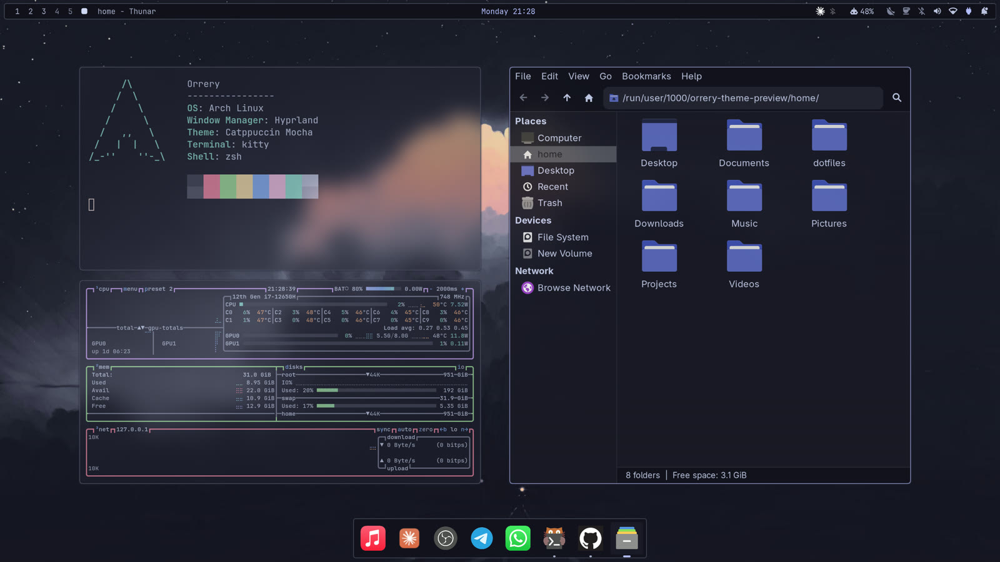
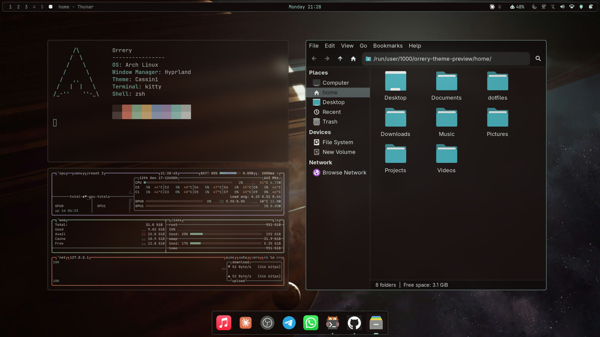
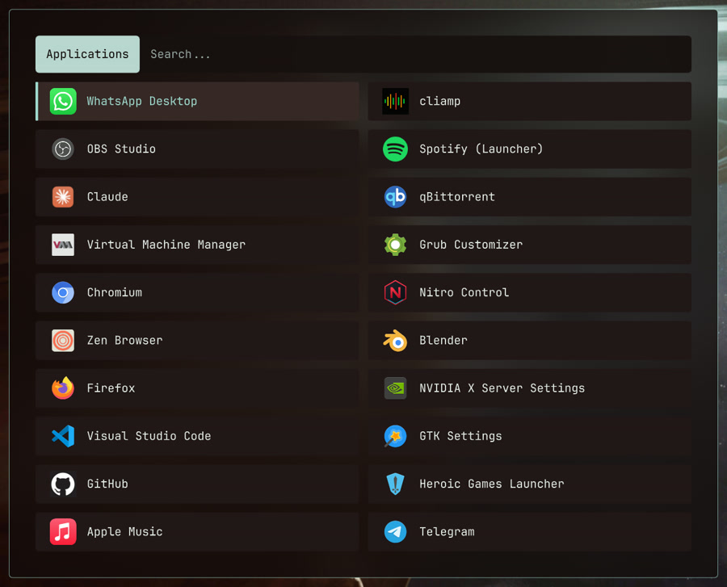
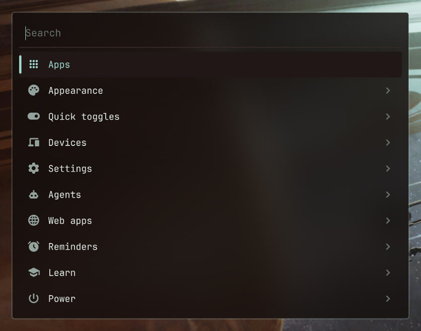

<div align="center">



**A complete, themeable Hyprland desktop for Arch Linux.**<br>
Switch the theme and everything follows: the shell, terminals, GTK and Qt apps, Neovim,
VS Code, Firefox, Spotify and the login screen.


[Install](#install) · [Keybinds](#keybinds) · [Make it yours](#make-it-yours) · [Help](#troubleshooting)

</div>


https://github.com/user-attachments/assets/a86c8b7f-421c-4d59-ae3d-25050f7ee63c


## Themes



Four themes ship with it: **Eclipse** (dark greys), **Zenith** (the same on white),
**Catppuccin Mocha** and **Cassini** (ice-teal on deep space). Switch live with
**`SUPER` `CTRL` `SHIFT` `SPACE`**.

<details>
<summary>Screenshots of each theme</summary>
<br>

| | |
|---|---|
|  |  |
|  |  |
|  |  |

</details>

## Features

- **One palette, every app**, dark or light. Most apps follow a theme switch instantly.
- **A shell built on [Quickshell](https://quickshell.org/)**: a bar in three styles on any screen
  edge, a dock, panels for sound, Wi-Fi, Bluetooth, power, notifications and media, a lock
  screen and a power menu.
- **One menu for everything** (`SUPER` `SPACE`): theme, wallpaper, bar, dock, fonts, Wi-Fi,
  Bluetooth, web apps, keybindings.
- **Launcher and clipboard history** with image previews.
- **Web apps**: turn any site into an app with its own window and dock icon.
- **An `/orrery` skill** for Claude Code, Codex, OpenCode and Gemini: ask for a theme, a widget
  or a fix in plain words.

## Install

> **You need** Arch Linux or an Arch-based distro (CachyOS, EndeavourOS…).

```bash
sudo pacman -Syu --needed git
git clone https://github.com/thomasmartinoa/Orrery-dotfiles.git ~/Orrery-dotfiles
cd ~/Orrery-dotfiles && ./install.sh
```

Reboot, choose **Hyprland** on the login screen, and press **`SUPER` `SPACE`** to find
everything. To update: `cd ~/Orrery-dotfiles && git pull && ./install.sh`.

The installer installs the packages (offering to build `yay` for the three AUR ones), backs up
any configs in the way after asking, links the configs with GNU Stow and enables
NetworkManager, Bluetooth, power profiles and SDDM. It's safe to run again and never deletes
your files.

<details>
<summary>Installer options</summary>

| Flag | |
|---|---|
| `--dry-run` | Show what would happen, change nothing |
| `--stow-only` | Skip installing packages |
| `--migrate` · `--no-migrate` | Back up blocking files without asking · never move anything |
| `--skip-root` | Don't touch `/root`, SDDM or sudoers |
| `--no-aur` | Skip the AUR packages |

</details>

### After installing

- **Keyboard layout** is US. Set yours in `~/.config/hypr/hyprland.local.lua` (updates never
  touch it), then `hyprctl reload`:
  ```lua
  hl.config({ input = { kb_layout = "de" } })
  ```
- **Display scale** is automatic. Change it in Menu › Appearance › Display scale.
- **A browser** isn't installed for you. `SUPER` `B` opens Zen, Firefox, Chromium or Brave,
  whichever it finds first.

<details>
<summary>Optional: Spotify and Claude Code colours</summary>

**Spotify** follows the theme through [Spicetify](https://spicetify.app/):

```bash
yay -S spotify-launcher spicetify-cli
spicetify config spotify_path ~/.local/share/spotify-launcher/install/usr/share/spotify
orrery-theme reload
```

**Claude Code**: run `/theme` once and pick **Auto (match terminal)**.

</details>

## Keybinds

| Keys | Action |
|---|---|
| `SUPER` `SPACE` | The menu |
| `SUPER` `Return` | Terminal |
| `SUPER` `D` · `V` | App launcher · clipboard history |
| `SUPER` `E` · `B` | File manager · browser |
| `SUPER` `Q` · `T` · `F` | Close · float · fullscreen |
| `SUPER` `1`–`0` | Go to workspace (add `SHIFT` to move the window there) |
| `SUPER` `L` · `M` | Lock screen · power menu |
| `SUPER` `CTRL` `SHIFT` `SPACE` | Theme picker |
| `SUPER` `CTRL` `R` | Restart the shell |
| `Print` · `SUPER` `Print` | Screenshot a region · the whole screen |

The full list is under Menu › Learn and in
[`modules/binds.lua`](hyprland/.config/hypr/modules/binds.lua).

## Make it yours

- **Ask your coding agent.** The installer links the `/orrery` skill into Claude Code, Codex,
  OpenCode and Gemini CLI: *"make a warm dark theme called ember from ~/Pictures/forest.jpg"*.
- **Bar, dock, fonts, corners and borders:** Menu › Appearance.
- **Your own keybinds** go in `~/.config/hypr/modules/binds.local.lua`. Updates never touch it.

<details>
<summary>Make a theme by hand</summary>

```bash
cd ~/.config/orrery/themes
cp -r eclipse ember && rm ember/backgrounds/* ember/preview.jpg
cp ~/Pictures/forest.jpg ember/backgrounds/1-forest.jpg
$EDITOR ember/colors.toml        # the name, mode = "dark"|"light", and the colours
orrery-theme set ember
orrery-theme-preview ember       # a screenshot for the theme picker
```

</details>

## Troubleshooting

| Problem | Fix |
|---|---|
| Something looks wrong | `orrery-doctor --share` prints a diagnostics report that's safe to paste into an [issue](https://github.com/thomasmartinoa/Orrery-dotfiles/issues/new/choose) |
| Boxes instead of icons | `sudo pacman -S ttf-jetbrains-mono-nerd` |
| The login screen is black | From a TTY (`Ctrl` `Alt` `F3`): `sudo rm /etc/sddm.conf.d/10-wayland.conf`, then reboot |
| The bar or dock is missing | `SUPER` `CTRL` `R` restarts the shell; `qs log` shows why it stopped |
| The Wi-Fi panel is empty | Your network isn't run by NetworkManager; the installer prints how to switch |
| Headphones work but apps use the laptop mic | `orrery-fix-mic` |

## Credits

Built on [Hyprland](https://hyprland.org/), [Quickshell](https://quickshell.org/),
[LazyVim](https://www.lazyvim.org/) and [Catppuccin](https://catppuccin.com/). Icons are
Google's [Material Symbols](https://fonts.google.com/icons) (Apache 2.0). Plenty of ideas come
from [Omarchy](https://omarchy.org/).

The wallpapers aren't mine and aren't covered by the licence. Eclipse's is Mount Ararat over
Yerevan (photographer unknown); the others came from wallpaper sites (Cassini's is wallhaven
7jeozo) without a traceable author. If one is yours, open an issue and it will be credited or
removed.

Questions, ideas and your own themes are welcome in
[Discussions](https://github.com/thomasmartinoa/Orrery-dotfiles/discussions).
The configuration is [MIT](LICENSE).
